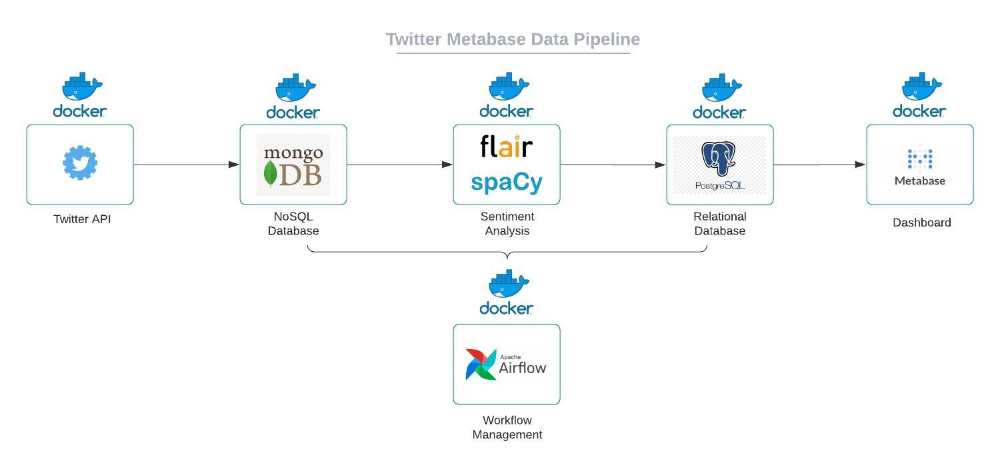

# Project: Twitter Metabase Data Pipeline

### Background

As an example data engineering project this data pipeline implements several docker containers organised via docker-compose and managed and scheduled through Apache Airflow.  
[Docker](https://www.docker.com/) can package an application and its dependencies in a virtual container that can run on any machine and thus makes deployment much easier.  
[Airflow](https://airflow.apache.org/) is a Python workflow management platform originally developed at Airbnb that is open-source.

### Goal

Build a Dockerized Data Pipeline that stores a stream of Twitter data in databases, analyzes the sentiment of tweets and visualizes the results on Metabase.

* Build an infrastructure of docker containers
* Collect Tweets through Twitter API (car manufacturers as keywords: Tesla, Volkswagen, Renault, Toyota, Hyundai, Fiat, Geely)
* Store Tweets in a Mongo DB
* Perform sentiment analysis with [vaderSentiment](https://github.com/cjhutto/vaderSentiment) and [Flair](https://github.com/flairNLP/flair)
* Store transformed Tweets in Postgres database
* Visualize data as [Metabase](https://www.metabase.com/) dashboard

### Usage

* Install docker on your machine
* Clone the repository
* Get credentials for Twitter API and insert them in config.py
* Run docker-compose build, then docker-compose up in terminal
